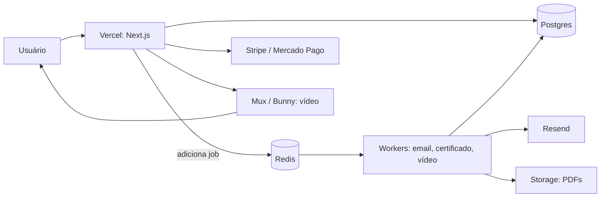

# Arquitetura

## Visão geral

Next.js full-stack (App Router) em um único projeto: Server Components/Server Actions para UI e mutações, Route Handlers (`app/api`) para checkout e webhooks, e um processo Node separado para os workers BullMQ. Postgres e Redis são serviços externos (Railway/Render em produção, Docker local em dev).



Frontend vai para a Vercel; tudo que é "always-on" (Postgres, Redis, workers) vai para Railway/Render, pois serverless não mantém processo vivo entre requisições.

## Grupos de rotas (`app/`)

| Grupo | Rotas | Proteção |
|---|---|---|
| Marketing | `/`, `/planos`, `/curso/[slug]` (vitrine) | pública; detalhe do curso mostra player só com acesso |
| `(auth)` | `/login`, `/cadastro`, `/recuperar-senha`, `/redefinir-senha` | redireciona p/ `/meus-cursos` se já logado |
| `(dashboard)` | `/meus-cursos`, `/curso/[slug]`, `/certificados` | login (`middleware.ts`) |
| `(admin)` | `/admin/cursos…`, `/admin/alunos` | `ADMIN`/`INSTRUCTOR` (layout + actions) |
| Checkout | `/checkout/[slug]`, `/checkout/sucesso` | login no momento do pagamento |
| Certificados | `/certificados/verificar/[hash]` | **pública** (credibilidade do certificado) |
| API | `api/checkout/*`, `api/webhooks/*`, `api/lessons/*`, `api/admin/*`, `api/auth/*` | variada (ver cada doc) |

Páginas que consultam o banco usam `export const dynamic = "force-dynamic"` para não quebrar o `next build` sem banco (prerender não acessa o Postgres).

## Camada `lib/`

| Arquivo | Responsabilidade |
|---|---|
| `prisma.ts` | Singleton do PrismaClient (evita múltiplas conexões em dev) |
| `auth.ts` | `getCurrentUser()`, `requireRole()` — defesa em profundidade nas actions |
| `access.ts` | `hasAccessToCourse(userId, courseId)` — **único lugar** que decide acesso (matrícula OU assinatura) |
| `stripe.ts` / `mercadopago.ts` | Clients com fallback dummy p/ build; chaves reais via env |
| `resend.ts` | Client de email (usado só nos workers) |
| `mux-signed-url.ts` / `bunny-signed-url.ts` | URLs assinadas de 4h |
| `certificates.ts` / `generate-certificate-pdf.ts` | Elegibilidade + PDF (Puppeteer; `@sparticuz/chromium` em serverless) |
| `storage.ts` | Upload do PDF (trocar pelo SDK S3/R2 real em produção) |
| `queue/` | `connection`, `queues` (3 filas), `producers/*` |

## Workers (`workers/`)

`index.ts` importa os três workers (ponto de entrada único). Ver [FILAS.md](FILAS.md).

## Modelo de dados (resumo)

```
User (STUDENT|INSTRUCTOR|ADMIN)
Course (DRAFT|PUBLISHED|ARCHIVED, priceCents, instructorId)
  └─ Module (order) └─ Lesson (VIDEO|TEXT|QUIZ, videoAssetId, order, isFreePreview)
Enrollment @@unique(userId, courseId)   — compra única
LessonProgress @@unique(userId, lessonId)
Payment gatewayChargeId @unique         — idempotência de webhook
Certificate verificationHash @unique + @@unique(userId, courseId)
Coupon
Plan ── PlanCourse (N:N p/ subconjunto) ── Course
Subscription (ACTIVE|PAST_DUE|CANCELED|EXPIRED, gatewaySubscriptionId @unique)
PasswordResetToken (token @unique, expiresAt, usedAt)
FailedJob (dead letter das filas)
```

Schema completo em `prisma/schema.prisma`; baseline SQL em `prisma/migrations/000_init/migration.sql`.

## Decisões arquiteturais

1. **Centavos (`Int`), nunca `Float`** — sem erro de arredondamento em dinheiro; MP recebe `priceCents/100` (decimal) só na borda.
2. **`videoAssetId`, não URL** — a URL assinada é gerada por acesso, com expiração curta.
3. **Unicidades como garantia de idempotência** — `gatewayChargeId`, `userId+courseId`, `jobId` fixo no certificado.
4. **Fila em vez de chamada síncrona** — email, PDF e webhook de vídeo nunca travam a requisição; retry com backoff exponencial.
5. **Acesso centralizado** — toda checagem passa por `hasAccessToCourse()`; adicionar novo modelo de acesso = mudar um lugar.
6. **Build sem banco** — páginas de dados são `force-dynamic`; SDKs têm fallbacks dummy; credenciais construídas dentro dos handlers.
